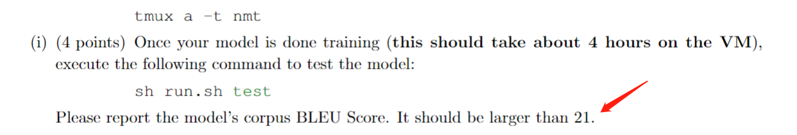
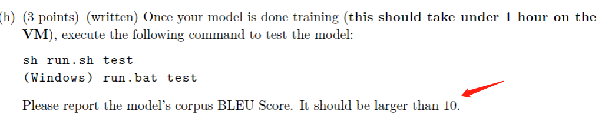
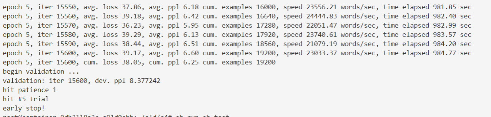
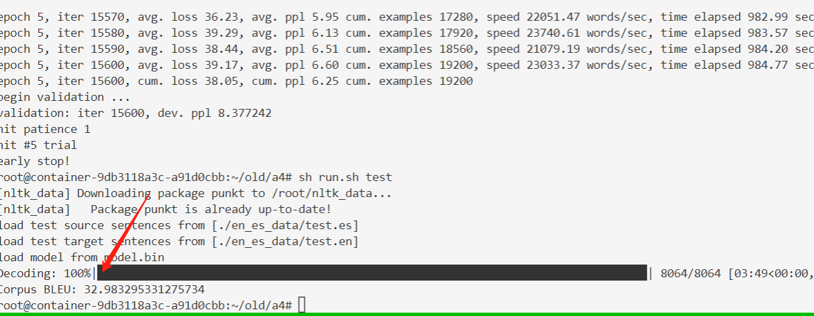
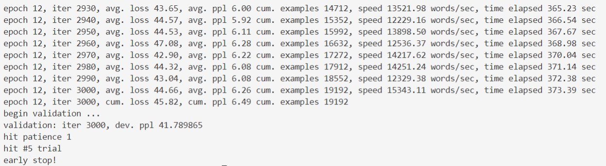
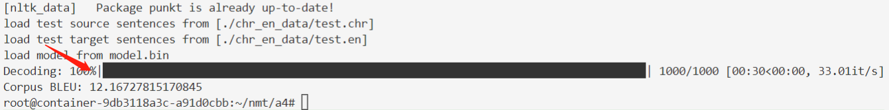

# 任务： Seq2Seq模型实现 

## 实验要求和答案

- 实现utils.py中的pad sends函数，对batch中的example进行padding补全。 

```python
max_len = 0
for sent in sents:
    max_len = max(len(sent), max_len)
for sent in sents:
    sents_padded.append(sent[:] + [pad_token] * (max_len - len(sent)))
```

- 实现model_embeddings.py中__init__函数，对source和target embeddings进行初始化。 

```python
self.source = nn.Embedding(
    num_embeddings=len(vocab.src),
    embedding_dim=self.embed_size, 
    padding_idx=src_pad_token_idx
)
self.target = nn.Embedding(
    num_embeddings=len(vocab.tgt), 
    embedding_dim=self.embed_size, 
    padding_idx=tgt_pad_token_idx
)
```

- 实现nmt_model.py中的__init__函数，对NMT模型参数进行初始化，包括embedings(使用 model_embeddings中的embedding），LSTM（layer、dropout、projection)。 

```python

self.encoder = nn.LSTM(input_size=embed_size, hidden_size=hidden_size, bias=True, bidirectional=True) 
self.decoder = nn.LSTMCell(input_size=embed_size + hidden_size, hidden_size=hidden_size, bias=True)
self.h_projection = nn.Linear(2 * hidden_size, hidden_size, bias=False)
self.c_projection = nn.Linear(2 * hidden_size, hidden_size, bias=False)
self.att_projection = nn.Linear(2 * hidden_size, hidden_size, bias=False)
self.combined_output_projection = nn.Linear(3 * hidden_size, hidden_size, bias=False)
self.target_vocab_projection = nn.Linear(hidden_size, len(vocab.tgt), bias=False)
self.dropout = nn.Dropout(dropout_rate)
```

- 实现nmt_model.py中的encoder函数，将输入句子转换为hidden表示，可以执行：python sanity_check.py 1d进行初步的正确性检查 

```python
X = self.model_embeddings.source(source_padded) #   (src_len, b, e)
X = pack_padded_sequence(input=X, lengths=source_lengths, batch_first=False)
enc_hiddens, (init_decoder_hidden, init_decoder_cell) = self.encoder(X)
enc_hiddens, _ = pad_packed_sequence(enc_hiddens, batch_first=True) #   (src_len, b, h*2)

init_decoder_hidden = torch.cat([init_decoder_hidden[0], init_decoder_hidden[1]], dim=1)    #   (b, 2*h)
init_decoder_hidden = self.h_projection(init_decoder_hidden)
init_decoder_cell = torch.cat([init_decoder_cell[0], init_decoder_cell[1]], dim=1)    #   (b, 2*h)
init_decoder_cell = self.c_projection(init_decoder_cell)
dec_init_state = (init_decoder_hidden, init_decoder_cell)   #   (b, h)
```

- 实现nmt_model.py中的decoder函数。该函数通过逐步调用step函数将hidden表示进行解码。可以执行：python sanity_check.py 1e进行初步的正确性检查。 

```python
enc_hiddens_proj = self.att_projection(enc_hiddens) #   (b, src_len, h)
Y = self.model_embeddings.target(target_padded) #   (tgt_len, b, e)
for Y_t in torch.split(Y, 1, 0):   #   (1, b, e)
    Ybar_t = torch.cat([Y_t.squeeze(0), o_prev], dim=-1)    #   #   (b, e + h)
    dec_state, o_t, e_t = self.step(Ybar_t, dec_state, enc_hiddens, enc_hiddens_proj, enc_masks)
    combined_outputs.append(o_t)
    o_prev = o_t
    combined_outputs = torch.stack(combined_outputs, dim=0)
```

- 实现nmt_model.py中的step函数。该函数对解码过程中的LSTM cell进行计算，包括target word 的encoding h\attention encoding e\output encoding o。可以执行：python sanity_check.py 1f  进行初步的正确性检查。 

```python
dec_state = self.decoder(Ybar_t, dec_state)
dec_hidden, dec_cell = dec_state
e_t = (enc_hiddens_proj).bmm(dec_hidden.unsqueeze(-1)).squeeze(-1)

alpha_t = F.softmax(e_t, dim=-1)
a_t = (alpha_t.unsqueeze(1)).bmm(enc_hiddens).squeeze(1)
U_t = torch.cat([a_t, dec_hidden], dim=-1)
V_t = self.combined_output_projection(U_t)
O_t = self.dropout(torch.tanh(V_t))

combined_output = O_t
```

- 实现nmt_model.py中的generate sent masks函数，对batch中添加的padding进行mask操作（参考step函数中如何使用mask） 

- 运行代码

1. 产生vocab文件：sh run.sh vocab 
2. 训练：sh run.sh train 
3. 测试：sh run.sh test

注意：

CS224n 2019 用的语料是**英语**翻译**西班牙语**，作业BLEU应该大于 21 。



CS224n 2022 用的是**切罗基语**翻译**英语**，作业BLEU应该大于 10 。




## CS224n 2019 Assignment 4

在 CS224n 2019 Assignment 4 代码上，训练平台 RTX A5000 * 1卡，参数为：

```bash
CUDA_VISIBLE_DEVICES=0 python run.py train --train-src=./en_es_data/train.es --train-tgt=./en_es_data/train.en --dev-src=./en_es_data/dev.es --dev-tgt=./en_es_data/dev.en --vocab=vocab.json --cuda --lr=5e-4 --patience=1 --valid-niter=300 --batch-size=64 --dropout=.3
```

其余为默认参数，训练过程



实验结果 BLEU 为 32.98：



## CS224n 2022 Assignment 4

在 CS224n 2022 Assignment 4 代码上，训练平台 RTX A5000 * 1卡，参数为：

```bash
CUDA_VISIBLE_DEVICES=0 python3 run.py train --train-src=./chr_en_data/train.chr --train-tgt=./chr_en_data/train.en --dev-src=./chr_en_data/dev.chr --dev-tgt=./chr_en_data/dev.en --vocab=vocab.json --cuda --lr=5e-4 --patience=1 --valid-niter=300 --batch-size=64 --dropout=.3
```

其余为默认参数，训练过程：



实验结果 BLEU 为 12.16 ：


